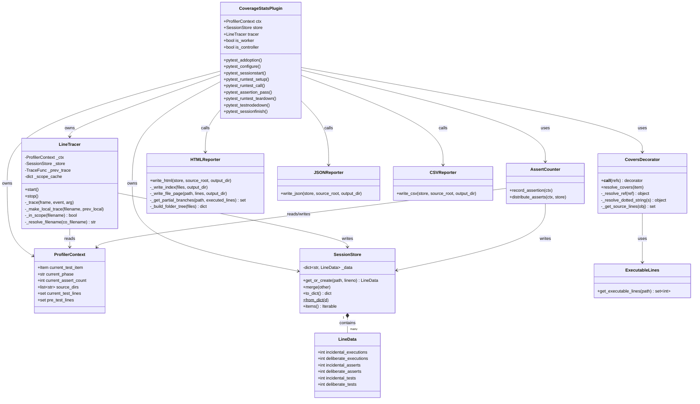
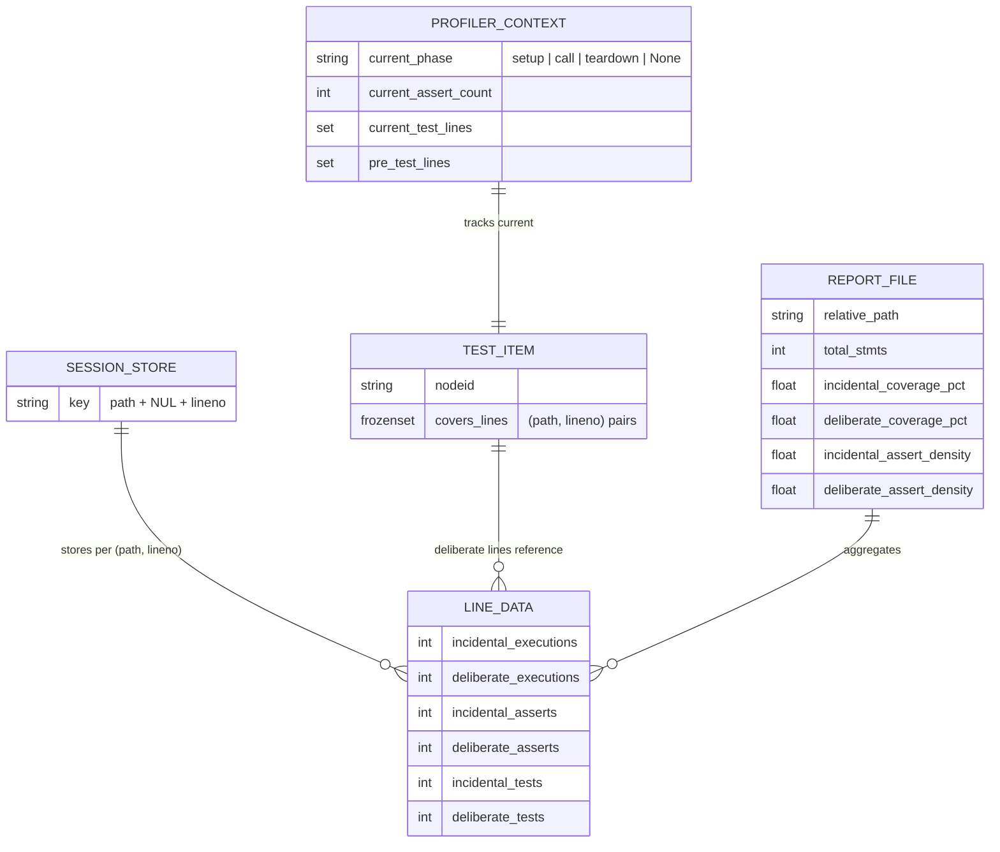
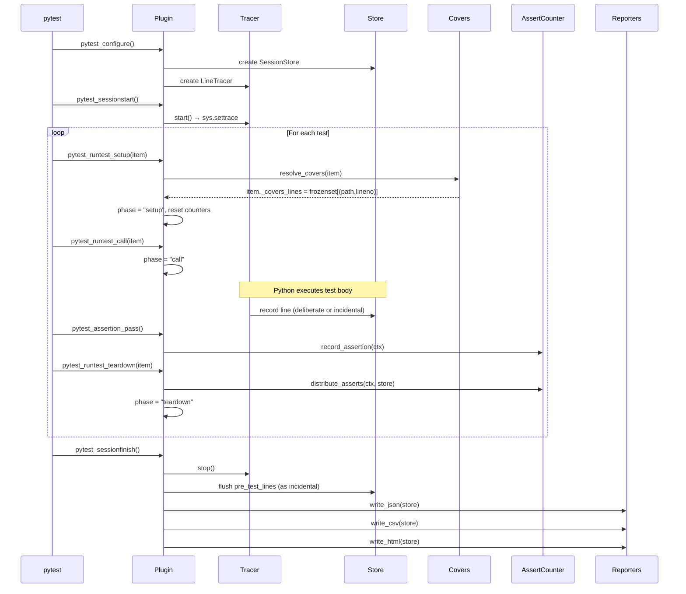
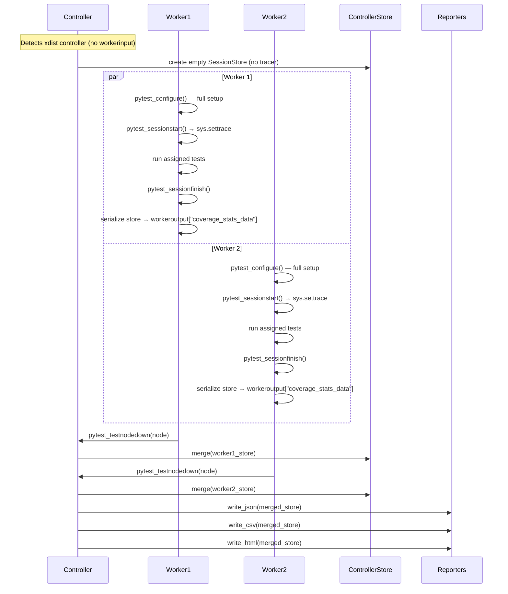
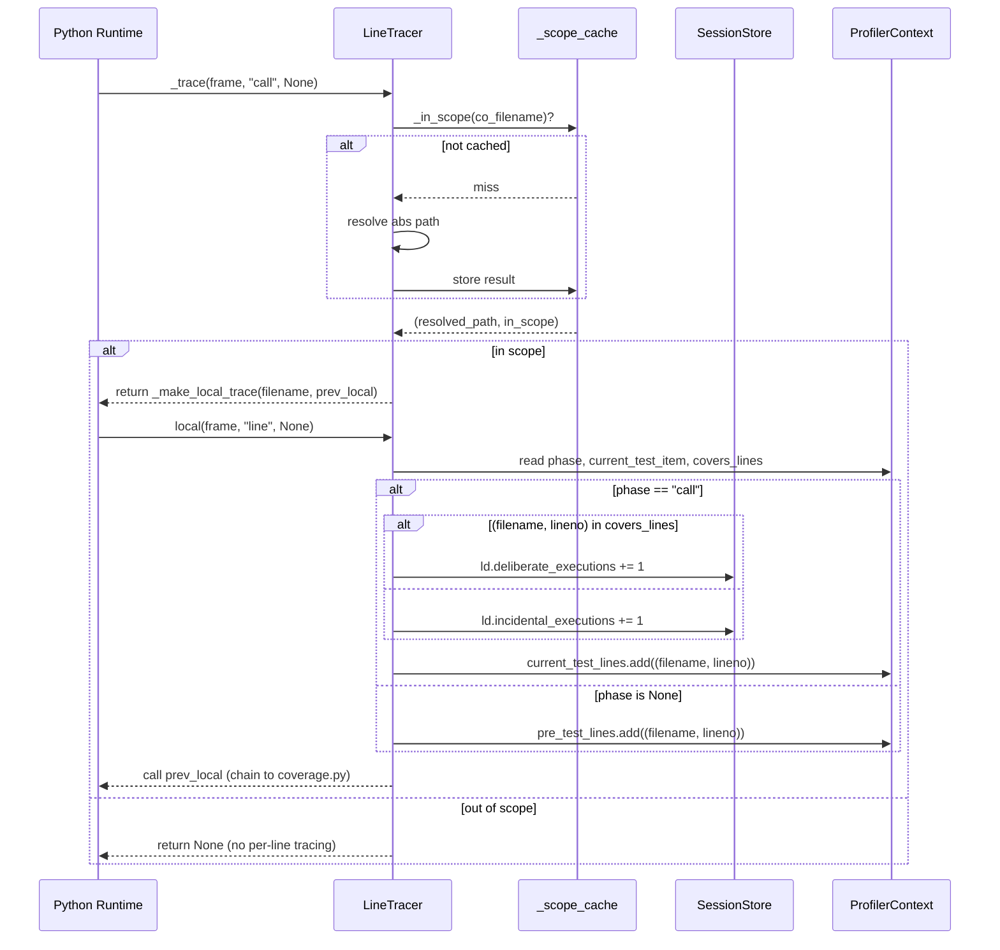
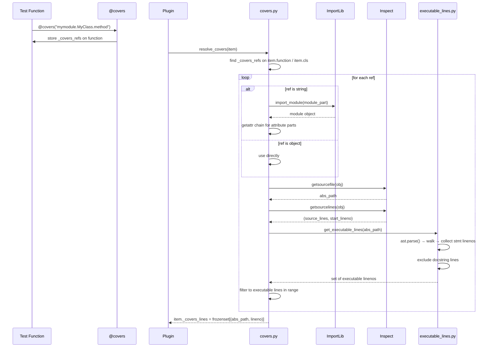
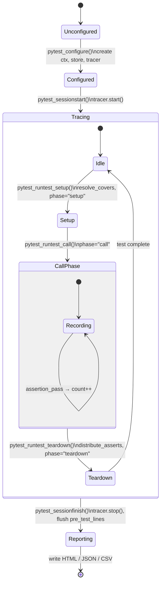
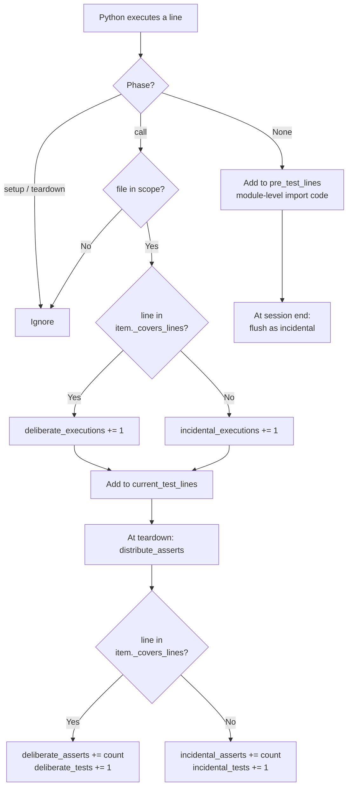
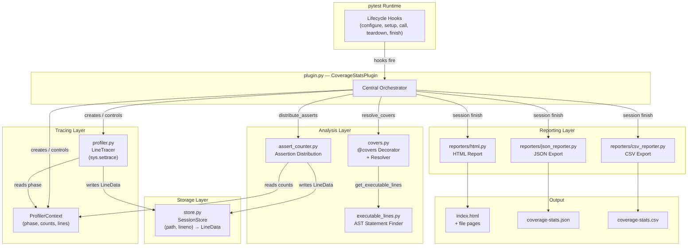

# Architecture: coverage-stats

A pytest plugin that tracks **deliberate vs. incidental line coverage** per test, with assertion density metrics, and generates HTML, JSON, and CSV reports.

---

## Table of Contents

1. [Project Structure](#project-structure)
2. [Component Overview](#component-overview)
3. [Class Diagram](#class-diagram)
4. [Data Model](#data-model)
5. [Sequence Diagrams](#sequence-diagrams)
   - [Single-Process Test Run](#single-process-test-run)
   - [xdist Parallel Run](#xdist-parallel-run)
   - [Line Execution Recording](#line-execution-recording)
   - [@covers Resolution](#covers-resolution)
6. [State Machine: Plugin Lifecycle](#state-machine-plugin-lifecycle)
7. [Flowchart: Line Categorization](#flowchart-line-categorization)
8. [Component Interaction](#component-interaction)

---

## Project Structure

```
coverage-stats/
├── src/coverage_stats/
│   ├── __init__.py              # Package entry point, exports @covers
│   ├── plugin.py                # Main pytest plugin — lifecycle hooks
│   ├── covers.py                # @covers decorator & reference resolver
│   ├── profiler.py              # sys.settrace line tracer
│   ├── store.py                 # Session store for line metrics
│   ├── assert_counter.py        # Assert counting & distribution
│   ├── executable_lines.py      # AST-based executable statement detection
│   └── reporters/
│       ├── __init__.py
│       ├── json_reporter.py     # JSON export
│       ├── csv_reporter.py      # CSV export
│       └── html.py              # HTML report generation
├── tests/
│   ├── unit/                    # Unit tests per module
│   ├── integration/             # Integration tests via pytester
│   └── conftest.py
└── pyproject.toml               # Build config, pytest11 entry point
```

---

## Component Overview

| Module | Role |
|---|---|
| `plugin.py` | Central orchestrator; implements all pytest hooks |
| `profiler.py` | Installs `sys.settrace` to record executed lines per test |
| `covers.py` | `@covers` decorator + lazy resolver that maps refs to `(path, lineno)` sets |
| `store.py` | `SessionStore` — maps `(path, lineno)` → `LineData` metrics |
| `assert_counter.py` | Counts passing assertions and distributes them across hit lines |
| `executable_lines.py` | AST-walks source files to find executable (non-comment) statements |
| `reporters/html.py` | Generates self-contained HTML index + per-file detail pages |
| `reporters/json_reporter.py` | Exports metrics as structured JSON |
| `reporters/csv_reporter.py` | Exports raw line-level data as CSV |

---

## Class Diagram



---

## Data Model



---

## Sequence Diagrams

### Single-Process Test Run



---

### xdist Parallel Run



---

### Line Execution Recording



---

### @covers Resolution



---

## State Machine: Plugin Lifecycle



---

## Flowchart: Line Categorization



---

## Component Interaction


